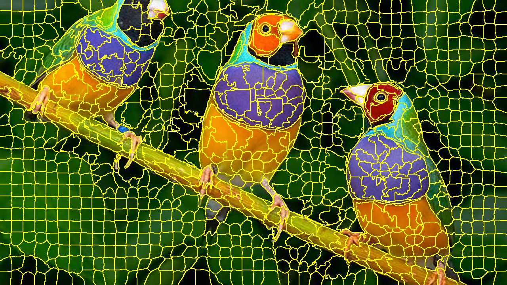

# Rust SLIC

[](https://github.com/lempiy/slic0/actions)
[](https://github.com/lempiy/slic0/LICENSE)
[](https://lempiy.github.io/slic0/doc/slic)

Rust realization of [Simple Linear Image Segmentation](http://infoscience.epfl.ch/record/177415/files/Superpixel_PAMI2011-2.pdf) 
algorithm with SLIC0 and lowest gradient seeding support.

#### Purpose

Library can be used in all areas where image pre-processing is required. 
* Content-based image retrieval
* Machine vision
* Object detection
* Recognition Tasks

More info [here](https://en.wikipedia.org/wiki/Image_segmentation).

#### [Documentation](https://lempiy.github.io/slic0/doc/slic)

#### Example

```rust
use slic::get_slic;
use image::{open};
fn main() {
    let mut image = open("./my_image.jpg").ok().expect("Cannot open image");
    let img = image.as_rgb8().expect("Cannot get RGB from DynamicImage");
    let mut slic = get_slic(img, 30, 10.0, true);
    slic.compute();
    // save segments net to file
    slic.get_borders_image().save("./borders.png").expect("Cannot save image on disk");
    // print segments as ASCII art to stdout
    slic.labels.iter().enumerate().for_each(|(i, x)| {
       print!("{}", ((32 + *x) as u8 as char).to_string());
       if ((i + 1) % img.width() as usize) == 0 {
           println!();
       }
    });
}
```

#### Case





#### License

MIT © [lempiy](https://github.com/lempiy)
